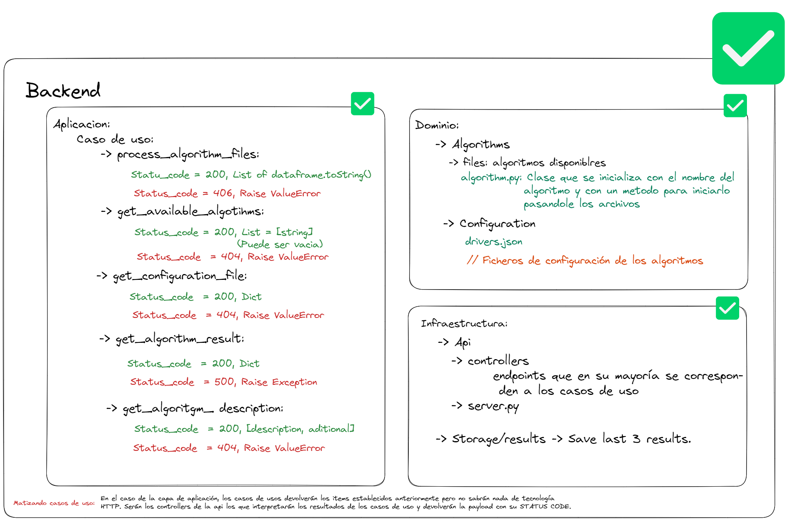
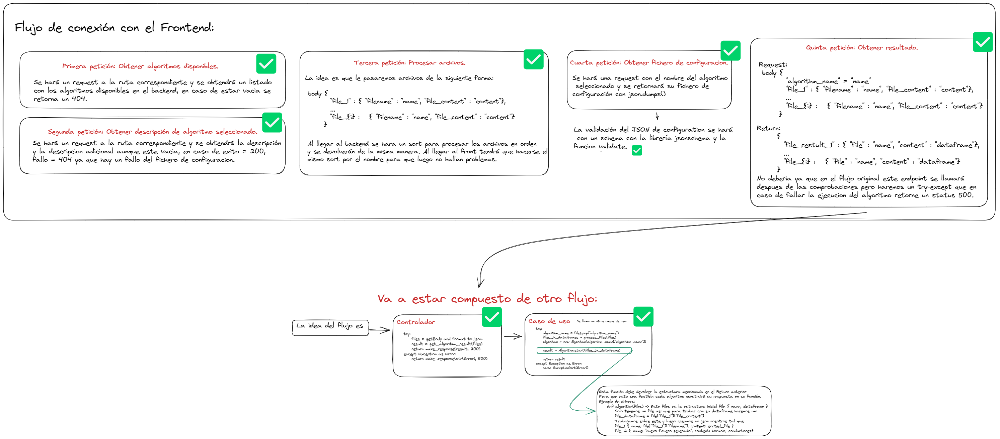
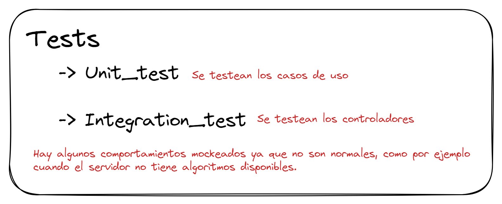
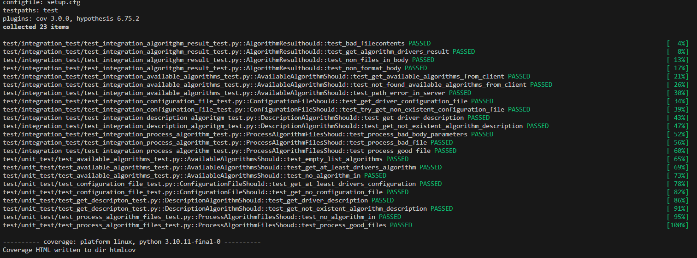
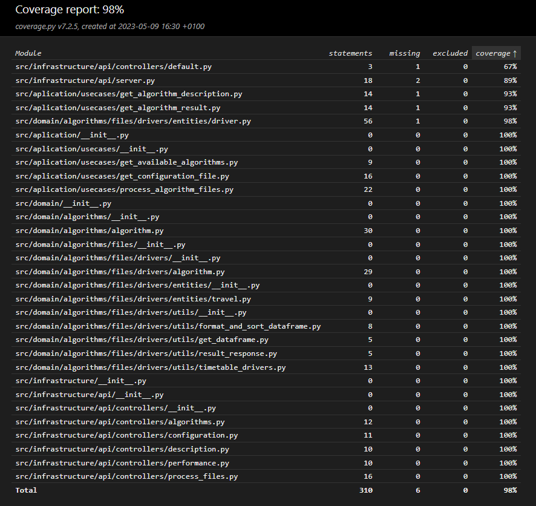

# **Trabajo final de grado**

Para el procesado de algoritmos de la interfaz visual de este trabajo final de grado se ha creado un servidor siguiendo la arquitectura hexagonal, cubierto por testing y con principios de código sostenible intentando que el código se explique por sí mismo con el nombre de las distintas variables y funciones. A continuacion podemos ver un esquema donde se refleja la estructura de carpetas y el flujo de los endpoints para que se conecte con el frontend





## **Testing**
Se han planteado tests unitarios para los casos de uso de la capa de aplicacion y tests de integracion que prueban los controladores del servidor.



Para el testing en este servidor se puede usar el comando `make tests` que ejecuta las siguientes funcionalidades:

1. **Ejecución de tests**: Se encarga de ejecutar todos los tests, tanto los unitarios como los de integracion y muestra por consola si fueron ejecutados correctamente o no. Además muestra el coverage de los distintos tests y genera un htmlcov donde se puede consultar el coverage de toddo el código:



## **Estructura de los archivos de configuración**

La estructura que deben seguir los archivos de configuracion para la creacion de nuevos algoritmo es la siguiente:

```json
 { 
  "name": "Nombre del algoritmo",
  "n_files": "Numero de ficheros a subir, excel o csv.",
  "n_cols": ["Primer nº de columnas para el archivo nº1", "Segundo nº de columna para el archivo nº2"],  
  "cols_types": [["Tipo de la primera columna del primer archivo", "..."], ["Tipo de la primera columna del segundo archivo", "..."]],
  "allowed_nulls": ["0: No se permiten nulls en el primer archivo", "1: Se permiten nulls en el segundo archivo"],
  "aditional_description": "Descripcion adicional que se quiera proporcionar en formato texto"
} 
```

## **Iniciar la aplicación**

Lo primero es instalar pyenv y pipenv con los siguientes comandos:

```bash
git clone https://github.com/pyenv/pyenv.git ~/.pyenv
```
```bash
echo 'export PYENV_ROOT="$HOME/.pyenv"' >> ~/.zshrc
echo 'command -v pyenv >/dev/null || export PATH="$PYENV_ROOT/bin:$PATH"' >> ~/.zshrc
echo 'eval "$(pyenv init -)"' >> ~/.zshrc
```
```bash
source ~/.zshrc
```
```bash
sudo apt-get update; sudo apt-get install make build-essential libssl-dev zlib1g-dev \
libbz2-dev libreadline-dev libsqlite3-dev wget curl llvm \
libncursesw5-dev xz-utils tk-dev libxml2-dev libxmlsec1-dev libffi-dev liblzma-dev
```
```bash
python -m pip install -U pip
pip install pipenv
```

Con esto hecho, podremos simplemente usar nuestro makefile con los comandos que necesitemos:

```bash
make setup
make run-server
```

En caso de querer ejecutar los tests podemos hacer:

```bash
make tests
```
## **Iniciar la aplicación con docker**