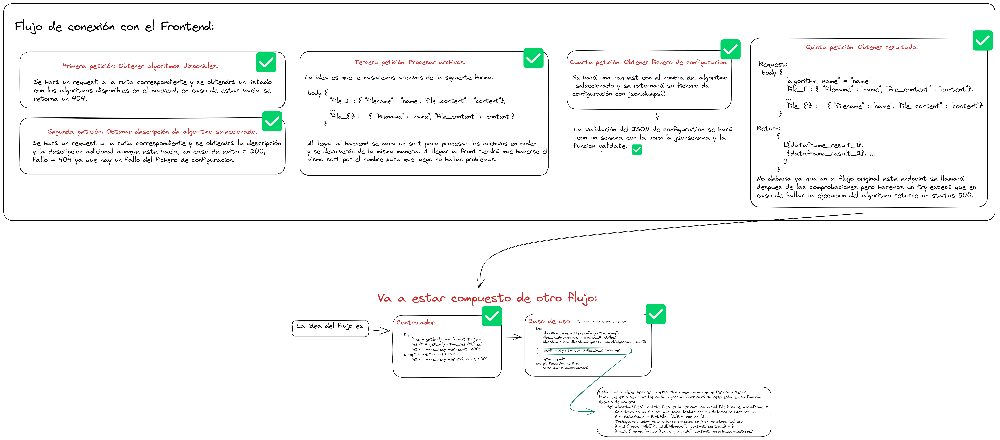

# **Trabajo final de grado**

Para el procesado de algoritmos de la interfaz visual de este trabajo final de grado se ha creado un servidor siguiendo la arquitectura hexagonal, cubierto por testing y con principios de código sostenible intentando que el código se explique por sí mismo con el nombre de las distintas variables y funnciones. A continuacion podemos ver un esquema donde se refleja la estructura de carpetas y el flujo de los endpoints para que se conecte con el frontend




## **Testing**
Se han planteado tests unitarios para los casos de uso de la capa de aplicacion y tests de integracion que prueban los controladores del servidor.


## **Estructura de los archivos de configuración**

La estructura que deben seguir los archivos de configuracion para la creacion de nuevos algoritmo es la siguiente:

```json
 { 
  "name": "Nombre del archivo de configuracion",
  "n_files": "Numero de ficheros a subir, excel o csv.",
  "n_cols": ["Primer nº de columnas para el archivo nº1", "Segundo nº de columna para el archivo nº2"],  
  "cols_types": [["Tipo de la primera columna del primer archivo", "..."], ["Tipo de la primera columna del segundo archivo", "..."]],
  "allowed_nulls": ["0: No se permiten nulls en el primer archivo", "1: Se permiten nulls en el segundo archivo"],
  "aditional_description": "Descripcion aicional que se quiera proporcionar en formato texto"
} 
```

## **Paquetes necesario**
* `pip install pandas`
* `pip install json`
* `pip install jsonschema`
* `pip install flask`

** Faltan
