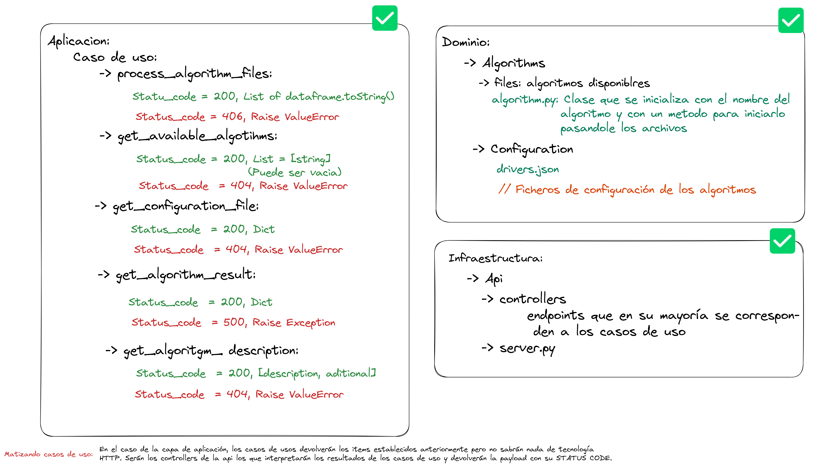

# **Trabajo final de grado**

Para el procesado de algoritmos de la interfaz visual de este trabajo final de grado se ha creado un servidor siguiendo la arquitectura hexagonal, cubierto por testing y con principios de código sostenible intentando que el código se explique por sí mismo con el nombre de las distintas variables y funciones. A continuacion podemos ver un esquema donde se refleja la estructura de carpetas y el flujo de los endpoints para que se conecte con el frontend




## **Testing**
Se han planteado tests unitarios para los casos de uso de la capa de aplicacion y tests de integracion que prueban los controladores del servidor.


Para el testing en este servidor se han añadido dos ficheros .bat ya que se ha desarrollado en windows, dichos scripts se pueden encontrar en la carpeta **test** y son los siguientes:
1. **execute_tests.bat**: Se encarga de ejecutar todos los tests, tanto los unitarios como los de integracion y muestra por consola si fueron ejecutados correctamente o no.

```powershell
python -m unittest discover -vs  .\unit_test\ -p "*_test.py"   
python -m unittest discover -vs .\integration_test\ -p "*_test.py"
```


2. **coverage_test.bat**: Se encarga de medir el coverage de los test ejecutando tanto los unitarion como los de integracion.

```powershell
python -m coverage run -m unittest discover -s .\unit_test\ -p "*_test.py"   
python -m coverage run -m unittest discover -s .\integration_test\ -p "*_test.py"
python -m  coverage report
```


## **Estructura de los archivos de configuración**

La estructura que deben seguir los archivos de configuracion para la creacion de nuevos algoritmo es la siguiente:

```json
 { 
  "name": "Nombre del archivo de configuracion",
  "n_files": "Numero de ficheros a subir, excel o csv.",
  "n_cols": ["Primer nº de columnas para el archivo nº1", "Segundo nº de columna para el archivo nº2"],  
  "cols_types": [["Tipo de la primera columna del primer archivo", "..."], ["Tipo de la primera columna del segundo archivo", "..."]],
  "allowed_nulls": ["0: No se permiten nulls en el primer archivo", "1: Se permiten nulls en el segundo archivo"],
  "aditional_description": "Descripcion aicional que se quiera proporcionar en formato texto"
} 
```

## **Consideraciones**
A pesar de estar desarrollado en windows se ha trabajado de tal forma que lo unico que se debe cambiar para Linux seria la extension de los archivos .bat de test, de resto, a priori, no deberia dar ningun problema.

## **Paquetes necesario**
* `pip install pandas`
* `pip install json`
* `pip install jsonschema`
* `pip install flask`

** Faltan
