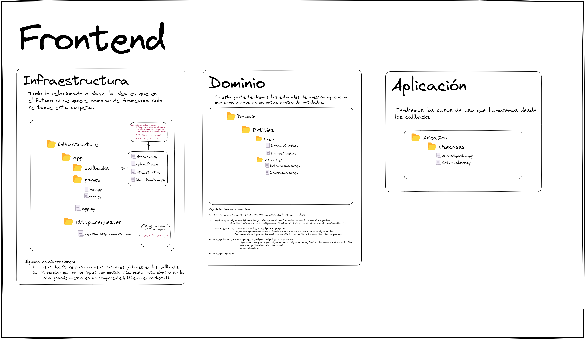

# **Trabajo final de grado**

Para la interfaz visual de este trabajo final de grado se ha seguido la arquitectura hexagonal. El planteamiento inicial es el siguiente:



A posteriori se decidió añadir repositorios para almacenar en el frontend la ejecucion de los algoritmos en una carpeta storage.

## **Consideraciones**
* Si se añaden algoritmos con tipos no añadidos (soportados) en los archivos de configuracion del backend tendra que modificarse en el usecase del frontend que crea el pandera shcema y valida que los dataframe de los archivos procesados sigan dicho schema. 

* El Datetime en el check por default tiene problemas con enteros ya que considera enteros como posibles datetime, el problema si se define un formato en especifico perderiamos muchos posibles formatos de datetime.

## **Iniciar la aplicación**

Lo primero es instalar pyenv y pipenv con los siguientes comandos:

```bash
git clone https://github.com/pyenv/pyenv.git ~/.pyenv
```
```bash
echo 'export PYENV_ROOT="$HOME/.pyenv"' >> ~/.zshrc
echo 'command -v pyenv >/dev/null || export PATH="$PYENV_ROOT/bin:$PATH"' >> ~/.zshrc
echo 'eval "$(pyenv init -)"' >> ~/.zshrc
```
```bash
source ~/.zshrc
```
```bash
sudo apt-get update; sudo apt-get install make build-essential libssl-dev zlib1g-dev \
libbz2-dev libreadline-dev libsqlite3-dev wget curl llvm \
libncursesw5-dev xz-utils tk-dev libxml2-dev libxmlsec1-dev libffi-dev liblzma-dev
```
```bash
python -m pip install -U pip
pip install pipenv
```

Con esto hecho, podremos simplemente usar nuestro makefile con los comandos que necesitemos:

```bash
make setup
make run-server
```
